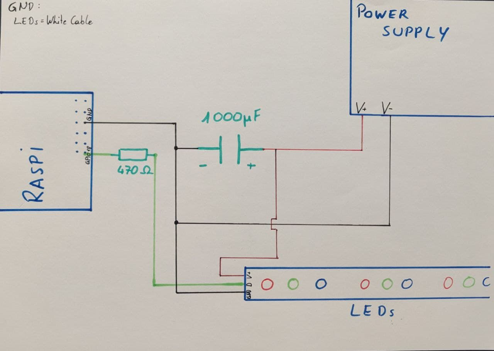

see https://github.com/bmedicke/smart-mirror

# Aruna

**Raspberry Pi based LED strip control (with individual LEDs)**

<!-- vim-markdown-toc GFM -->

  * [front-to-back.py](#front-to-backpy)
  * [back-to-hardware.py](#back-to-hardwarepy)
* [setup](#setup)
* [running it](#running-it)
* [supplemental](#supplemental)
  * [Power Circuit Diagramm](#power-circuit-diagramm)
  * [Pin Layout](#pin-layout)
  * [terminology](#terminology)
  * [useful links](#useful-links)
  * [useful repos](#useful-repos)

<!-- vim-markdown-toc -->

## front-to-back.py

* connects Home Assistant via MQTT to the database

## back-to-hardware.py

* translates database changes to the physical world

# setup

```sh
# install docker:
curl -fsSL https://get.docker.com -o get-docker.sh
sh ./get-docker.sh
rm get-docker.sh

# install docker-compose and postgres:
apt install docker-compose postgresql -y

# we only need it for the cli tools:
systemctl disable --now postgresql

# create and activate virtual environment:
python3 -m venv env
source env/bin/activate

# on rpi4 you might get an error about multiple
# definitions while installing rpi.gpio,
# to avoid them use the flag:
export CFLAGS=-fcommon

# upgrade/install libs:
pip install --upgrade adafruit-blinka
pip install --upgrade adafruit-circuitpython-neopixel
pip install --upgrade black

# [binary] version not yet supported for ARM.
pip install --upgrade 'psycopg[pool]'
```

# running it

```sh
# start db and adminer:
docker-compose up -d
```

# supplemental

## Power Circuit Diagramm

</img>

## Pin Layout


## terminology

* **entity**
	* sensors, automations, switches, scenes
* **device**
	* physical objects (that might have multiple entities)

## useful links

* [Device Registry](https://developers.home-assistant.io/docs/device_registry_index/)
* [HA MQTT Light Schemas](https://www.home-assistant.io/integrations/light.mqtt/)
	* template: the one tasmota uses
	* default: no flashing, transitions
	* **[json](https://www.home-assistant.io/integrations/light.mqtt/#json-schema)**: all features
		* [demo usage](https://community.home-assistant.io/t/mqtt-add-on-works-but-no-discovery/241680)
* [async-notifications with psycopg](https://www.psycopg.org/docs/advanced.html#asynchronous-notifications)
	* get notified of db-updates
	* [empty queries and performance impact](https://stackoverflow.com/questions/21117431/how-to-receive-automatic-notifications-about-changes-in-tables)
* [psycopg writeup](https://github.com/bmedicke/python-notes/blob/main/markdown/psycopg.md)

## useful repos

* https://github.com/bokub/rgb-light-card (Lovelace custom card for RGB lights)
